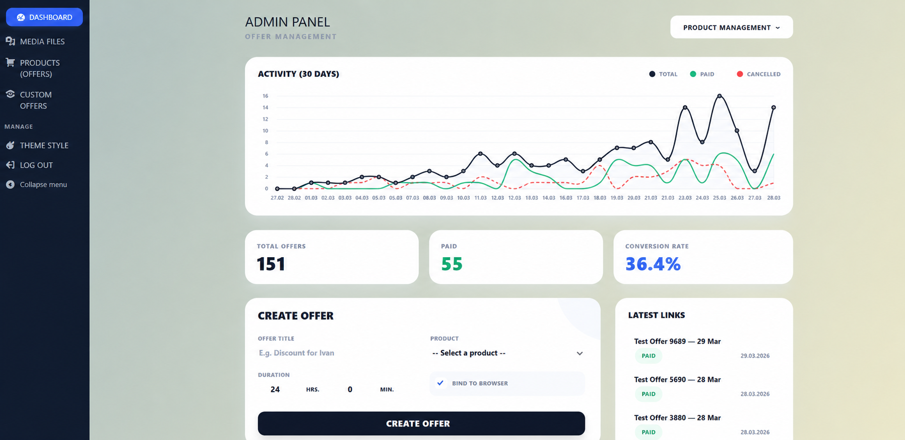

# Персональные платёжные ссылки на WordPress

Система **персональных офферов**: менеджер собирает предложение за секунды, клиент получает короткую ссылку с ценой и сроком жизни, оплата проходит через Robokassa. Публичный сайт и платёжный контур живут на **разных доменах** в одном Bedrock-проекте.

<p align="center">
  
</p>

<p align="center"><em>Кастомный дашборд вместо стандартного wp-admin: конверсия, активность, создание ссылки в одном экране.</em></p>

---

## Зачем это, а не «ещё один WooCommerce»

Обычный магазин плохо подходит для сценария «менеджер в чате согласовал цену и должен сразу выслать оплату». Здесь товар — это **шаблон** (`product_offer`), а продажа — **одноразовая персональная ссылка** (`personal_offer`):

- своя цена и количество;
- TTL с точностью до минут;
- опциональная привязка к браузеру клиента;
- статус `paid` после колбэка шлюза, а не «на честном слове»;
- на платёжном домене наружу торчат только офферы — остальное отдаёт чистый 404.

Менеджер не видит ядро WordPress: роль `offer_manager`, урезанное меню, редирект на дашборд, сессия 14 дней.

---

## Как устроен контур

```
                    ORDER_DOMAIN                         основной домен
                 (платежи + админка)                    (контент / витрина)
                          │                                      │
  Менеджер ──логин──► Дашборд ──создаёт──► personal_offer        │
                          │                      │               │
                          │                      ▼               │
                          │              /p/{случайный-токен}    │
                          │                      │               │
  Клиент ─────────────────┴──открывает ссылку────┘               │
                          │                                      │
                          ├── cookie-bind (опционально)          │
                          ├── POST /api/payment/robokassa/checkout
                          ├── Robokassa (Password1)
                          └── ResultURL + Password2 ──► paid
```

Хост сверяется с `ORDER_DOMAIN` уже на этапе конфига: `WP_HOME` / `WP_SITEURL` переключаются на платёжный домен. MU-плагины заказов подключаются **только** там (`order-domain-loader.php`). На основном сайте этот код даже не загружается.

---

## Дашборд менеджера

Скрин выше — не макет, а рабочий `wp-admin` на Tailwind (изолированный `preflight: false`, чтобы не ломать ядро) и Chart.js.

| Блок | Что считает |
| --- | --- |
| KPI | Всего офферов / оплачено / конверсия — агрегация SQL `GROUP BY post_status`, без `get_posts(-1)` |
| График 30 дней | Создано / оплачено / истекло по дате, истечение — по `_expiry_timestamp` |
| Создание оффера | Заголовок, товар, цена, TTL (часы + минуты), «привязать к браузеру» |
| Последние ссылки | Статус `PAID` / живой, копирование URL |

AJAX создания ссылки: nonce `manager_dashboard_nonce` + capability `manage_offers`.

---

## Модель данных

| CPT / статус | Роль |
| --- | --- |
| `product_offer` | Каталог товаров для менеджера. `publicly_queryable = false` — витрины нет |
| `personal_offer` | Экземпляр сделки, slug `/p/{16 символов}` |
| `offer_transaction` | Черновик платежа: сумма, провайдер, связь с оффером |
| статус `paid` | Кастомный `register_post_status` на оффере после ResultURL |

Срок жизни пишется в `_expiry_timestamp` (unix), не в «через N часов с момента открытия». Просроченная ссылка и повторная оплата отсекаются и на странице, и на checkout.

---

## Оплата Robokassa

1. Клиент жмёт оплату → `POST /payment/v1/robokassa/checkout`.
2. Проверки: оффер существует, не `paid`, не истёк, цена числовая.
3. Создаётся `offer_transaction` в `pending`; `InvId` для шлюза — ID транзакции, не оффера.
4. Редирект на Robokassa: подпись `md5(MerchantLogin:OutSum:InvId:Password1)`.
5. ResultURL проверяет `md5(OutSum:InvId:Password2)` (регистронезависимо). Идемпотентность: повторный колбэк на уже `success` отвечает `OK{InvId}` без двойной записи.
6. Success/Fail — редирект на permalink оффера с `?payment=success|fail`. Успешный просмотр один раз: фронт снимает query через `replaceState`, повтор без параметра — 404 (`already_paid`).

ЧПУ `/api/payment/robokassa/{checkout|result|success|fail}` мапится rewrite-правилом на REST. Логин и пароли шлюза — только из env (`ROBOKASSA_*`), в коде их нет.

---

## Защита ссылки

`OfferService::validateAccess()`:

- **TTL** — сравнение с `_expiry_timestamp`.
- **Уже оплачено** — доступ только с одноразовым `payment=success`.
- **Bind to browser** — при первом заходе в оффер пишется `md5` долгоживущего `persistent_client_id` (cookie на год). Чужой браузер получает `security_violation` → 404. Сам ID в БД не хранится, только хеш.

На `ORDER_DOMAIN` любой URL, кроме `personal_offer`, `wp-login` и служебных (`robots`, feed), режется ранним `template_redirect` со статическим 404 — без утечки структуры сайта.

---

## Стек

| Слой | Решение |
| --- | --- |
| Приложение | [Bedrock](https://roots.io/bedrock/) · WordPress 6.9 · PHP ≥ 8.3 |
| Конфиг | `.env` / `.env.local` · `vlucas/phpdotenv` · `oscarotero/env` |
| Тема | [Sage](https://roots.io/sage/) · Blade · Vite 7 · Tailwind 4 |
| Платежный домен | MU-plugins в `web/app/mu-plugins/order/` |
| Качество | Laravel Pint · Pest |

Секреты и дампы БД в git не хранятся (`.env`, `backup.sql`, `.agents` в ignore).

---

## Быстрый старт

```bash
composer install
cp .env.example .env   # DB_*, WP_HOME, WP_SITEURL, ORDER_DOMAIN, соли, ROBOKASSA_*
cd web/app/themes/ediet-theme && npm install && npm run build
```

Критичные переменные:

| Переменная | Назначение |
| --- | --- |
| `ORDER_DOMAIN` | Хост, на котором включаются дашборд, 404-локдаун и API оплаты |
| `ROBOKASSA_MERCHANT_LOGIN` | Логин магазина |
| `ROBOKASSA_PASSWORD_1` | Подпись checkout |
| `ROBOKASSA_PASSWORD_2` | Проверка ResultURL |
| `ROBOKASSA_IS_TEST` | `1` — тестовый платёж Robokassa |

В кабинете Robokassa ResultURL должен указывать на `https://{ORDER_DOMAIN}/api/payment/robokassa/result`.

Роль **Offer Manager** регистрируется при `init` (`app/roles.php`) и получает capability `manage_offers` плюс права на оба CPT.

---

## Карта кода

```
config/application.php              # переключение WP_HOME по ORDER_DOMAIN
web/app/mu-plugins/order-domain-loader.php
web/app/mu-plugins/order/
  offer_manager_admin.php           # дашборд, KPI, Chart.js, урезанный admin
  offers_404.php                    # локдаун публичных страниц
  api_offers_payment/               # REST + RobokassaGateway
web/app/themes/ediet-theme/app/
  roles.php  post-types.php  ajax-offers.php
  Services/OfferService.php         # создание ссылки, TTL, cookie-bind
```
